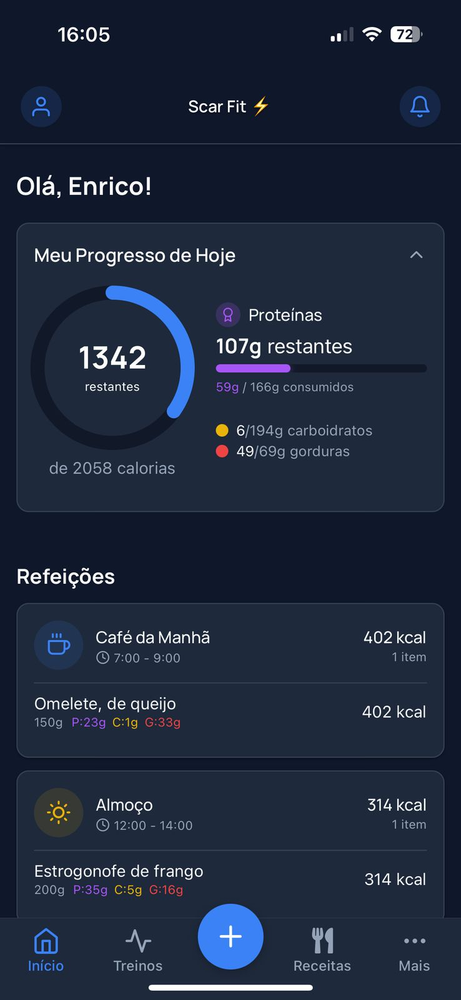

# ScarFit

ScarFit is a comprehensive fitness and nutrition tracking application built with React Native and Expo. The app helps users track their macronutrients, meals, and workouts to achieve their fitness goals.

## Features

- **Macro Tracking**: Calculate and track daily macronutrient intake (protein, carbs, fat)
- **Meal Logging**: Log meals with detailed nutrition information
- **Progress Visualization**: View daily and weekly progress with intuitive charts
- **User Profiles**: Create and manage user profiles with personalized goals
- **Dark Mode**: Toggle between light and dark themes
- **Authentication**: Secure user authentication with Supabase

## Tech Stack

- **Frontend**: React Native, Expo Router, NativeWind (Tailwind CSS for React Native)
- **Backend**: Supabase (Auth, Database)
- **State Management**: React Context API
- **Styling**: NativeWind/TailwindCSS
- **Icons**: Feather Icons
- **Navigation**: Expo Router

